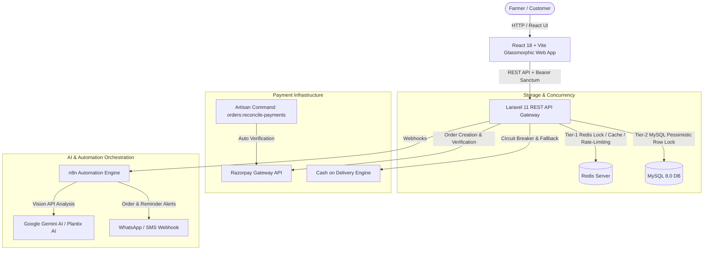

# 🌾 Sarkar Fertilizer & Agri-Tech AI Engine

[](https://laravel.com)
[](https://reactjs.org)
[](https://vitejs.dev)
[](https://www.typescriptlang.org/)
[](https://www.mysql.com/)
[](https://redis.io/)
[](https://n8n.io/)
[](https://razorpay.com/)

> An enterprise-grade, high-concurrency E-Commerce platform and AI-driven Agronomy assistant designed specifically for farmers, agricultural suppliers, and enterprise distributors. Built with modern Liquid Glass UI, two-tier Redis/MySQL concurrency locking, circuit-breaker protected payments, AI visual crop disease diagnosis, and n8n automated workflow orchestration.

---

## 📋 Table of Contents
1. [System Architecture](#-system-architecture)
2. [Added Technologies (Tech Stack)](#-added-technologies-tech-stack)
3. [All Features Implemented](#-all-features-implemented)
4. [How Each Feature Handles Logically (Deep Technical Details)](#-how-each-feature-handles-logically-deep-technical-details)
5. [n8n Automation Engine](#-n8n-automation-engine)
6. [Pending Features & Roadmap](#-pending-features--roadmap)
7. [Installation & Setup Guide](#-installation--setup-guide)
8. [CLI & Artisan Commands](#-cli--artisan-commands)

---

## 🏗️ System Architecture



---

## 🛠️ Added Technologies (Tech Stack)

### **Frontend (`/fertilizer-web`)**
- **Framework & Language:** React 18, TypeScript, Vite 5.
- **Styling & Theme:** Custom Glassmorphism CSS Architecture, Dynamic HSL Palettes, Modern Typography.
- **Icons & UI Utilities:** Lucide React, Framer Motion (micro-animations), Axios HTTP Client.
- **Features:** Dynamic Bento Grid Layout, Interactive Cart Drawer with Free Delivery Tracker, Quick-Apply Coupon Claiming, AI Chat & Vision Diagnosis Uploaders, Smart Crop Scheduler Calendar.

### **Backend API (`/fertilizer-api`)**
- **Framework & Environment:** PHP 8.2+, Laravel 11.x, Artisan CLI.
- **Authentication & Authorization:** Laravel Sanctum (Token-based API auth), Spatie Laravel-Permission (Role-Based Access Control: `Customer`, `Admin`).
- **Database ORM & Migrations:** Eloquent ORM, Foreign Key Constraints, Index Optimizations.
- **Concurrency & Caching:** Redis Cache Engine (`Cache::lock` distributed locks), Redis Rate Limiting Middleware (`throttle:auth`, `throttle:diagnosis`, `throttle:chat`).
- **PDF Generation:** Barryvdh DomPDF for downloadable tax invoices.

### **Database & State Management**
- **Primary Relational DB:** MySQL 8.0 (InnoDB engine supporting ACID transactions & `FOR UPDATE` row locks).
- **In-Memory Store:** Redis 7.x (High-speed key-value locking, session store, rate limits).

### **Automation & AI Engine (`/n8n-workflows`)**
- **Orchestration:** n8n Workflow Automation Platform.
- **AI Models:** Google Gemini 1.5 Flash / 3.6 Vision API for disease identification and multi-turn agronomy chat.
- **Workflow Pipelines:** 5 Custom JSON workflows (`1_chatbot.json`, `2_diagnosis.json`, `3_order_notifications.json`, `4_abandoned_cart.json`, `5_fertilizer_reminders.json`).

### **Payments & Security**
- **Payment Gateway:** Razorpay REST API SDK (`Razorpay\Api\Api`).
- **Resilience Pattern:** Custom `PaymentCircuitBreaker` service (Auto trips on failure threshold, fallback to COD).
- **Security:** HMAC SHA256 Signature Verification, Input Validation, CORS policy protection.

---

## ✨ All Features Implemented

| Feature Category | Implemented Feature Description |
| :--- | :--- |
| **🛒 E-Commerce & Checkout** | Interactive Product Catalog with Bento Grid visual layout, dynamic product filtering, search, and stock status indicators. |
| **📦 Smart Cart Drawer** | Slide-out Cart Drawer featuring a **Real-Time Free Delivery Progress Tracker** (calculating progress towards ₹999 threshold) and a **Quick-Apply Coupon List**. |
| **🎟️ Coupon Engine** | Support for fixed amount and percentage discounts, minimum order threshold validation, and first-order restriction for codes like `NEWFARMER`. |
| **⚡ High-Concurrency Locking** | **Two-Tier Concurrency System**: Tier-1 Redis Distributed Lock (`Cache::lock`) + Tier-2 MySQL Pessimistic Row Lock (`lockForUpdate`) preventing overselling during flash sales. |
| **💳 Payment Gateway** | Dual-payment integration (Razorpay Online + Cash on Delivery). Includes HMAC SHA256 signature verification and order status transitions (`PENDING` -> `CONFIRMED`). |
| **🛡️ Payment Circuit Breaker** | Self-healing circuit breaker (`PaymentCircuitBreaker`) monitoring gateway health. Automatically opens upon 3 consecutive gateway failures to route customers safely to COD. |
| **⏰ Payment Reconciliation** | Automated background job (`orders:reconcile-payments`) checking pending online orders created in the last 24 hours and reconciling statuses without manual user interaction. |
| **🌾 Plantix AI Diagnosis** | Visual Crop Disease Identifier allowing farmers to upload crop leaf images. Integrates with n8n + Gemini AI to output disease diagnosis, confidence score, organic cure, and recommended fertilizers. |
| **🤖 AI Agronomist Chatbot** | Conversational assistant providing real-time crop advice, fertilizing advice, weather tips, and product recommendations. Throttled via Redis to 20 requests/minute. |
| **📅 Crop Planner & Calendar** | Smart crop task schedule generator calculating sowing-to-harvest fertilizing steps and marking tasks completed. |
| **📊 Admin Dashboard** | Full back-office management for products, stock adjustments, order status bulk updates, inventory audit logging (`InventoryLog`), and payment circuit breaker controls. |

---

## 🔍 How Each Feature Handles Logically (Deep Technical Details)

### 1. Order Checkout & Two-Tier Concurrency Locking Workflow
```
[User Clicks Place Order]
       │
       ▼
[OrderController@store] ──► Parse & Hydrate Cart Items
       │
       ▼
[Tier-1: Redis Distributed Lock]
  ├── Iterates over product IDs in order
  ├── Tries Cache::lock("redis_inventory_lock_product_{id}", 5)
  └── If lock unavailable -> Blocks up to 2s or throws "High traffic demand" error
       │
       ▼
[Tier-2: DB Transaction + MySQL Row Lock]
  ├── DB::transaction() starts
  ├── For each item: Product::where('id', $id)->lockForUpdate()->first()
  ├── Verifies stock_qty >= requested qty
  ├── If stock insufficient -> Throws exception (Triggers DB rollback)
  ├── Decrements product stock_qty atomically
  ├── Creates Order & OrderItems records
  └── Writes InventoryLog entry (Type: 'SALE', Qty: -N, Reason: "Order placement")
       │
       ▼
[Release Redis Locks & Return Response]
  ├── Releases all held Redis locks in `finally` block
  ├── Clears User Cart
  └── Generates Razorpay Order ID (if Payment Method is ONLINE)
```

### 2. Payment Verification & Circuit Breaker Workflow
- **Circuit Breaker Check:** Before initiating a Razorpay API call, `RazorpayController` queries `PaymentCircuitBreaker->isAvailable()`.
  - **Closed State (Normal):** Requests pass through to Razorpay API.
  - **Open State (Tripped):** If 3 failures occur within 60 seconds, circuit opens. API immediately returns HTTP 503 (`circuit_open: true`) advising user to switch to COD.
  - **Half-Open State:** Automatically tests gateway recovery after timeout.
- **HMAC Signature Verification (`verifyPayment`):**
  - Receives `razorpay_order_id`, `razorpay_payment_id`, and `razorpay_signature`.
  - Computes `expected_signature = hash_hmac('sha256', order_id + '|' + payment_id, secret)`.
  - Performs constant-time comparison `hash_equals(expected_signature, razorpay_signature)`.
  - On success: Records successful transaction in `payments` table, updates `orders.payment_status = 'PAID'`, sets `orders.status = 'CONFIRMED'`, and notifies `PaymentCircuitBreaker->recordSuccess()`.

### 3. Background Payment Reconciliation (`orders:reconcile-payments`)
- **Execution:** Run periodically via Linux Cron or Laravel Scheduler (`php artisan orders:reconcile-payments`).
- **Query Filter:** Selects orders where `payment_method = 'ONLINE'`, `payment_status = 'PENDING'`, and `created_at >= 24 hours ago`.
- **Reconciliation Logic:**
  - Evaluates orders pending for over 2 minutes.
  - Updates `Payment` record with gateway reference and status `SUCCESS`.
  - Transitions order status to `PAID` and `CONFIRMED`.
  - Triggers n8n Webhook (`N8N_ORDER_WEBHOOK_URL`) to dispatch a confirmation notification to the customer's phone.

### 4. AI Visual Crop Diagnosis Pipeline
- **Image Upload:** User submits crop image file or base64 data to `/api/diagnose`.
- **Rate Limit:** Throttled to 5 requests/minute per user IP via Redis (`throttle:diagnosis`).
- **Processing:**
  - Creates pending `CropDiagnosis` record in DB.
  - Dispatches payload to n8n Webhook (`2_diagnosis.json`).
  - n8n calls Google Gemini Vision API to analyze plant pathology.
  - n8n calls callback endpoint `/api/webhooks/n8n/diagnosis-result` to persist detected disease, severity, organic/chemical treatment, and matching fertilizer product links.

### 5. Cart Drawer & Incentive Engine Logic
- **Free Delivery Calculation:**
  - Total Threshold: `₹999.00`.
  - If `afterDiscount >= 999`: `shipping = 0`, progress = 100%.
  - If `afterDiscount < 999`: `shipping = ₹50.00`, progress = `(afterDiscount / 999) * 100`.
- **Coupon Validation (`calculateCart`):**
  - Validates `is_active = true` and `expires_at > NOW()`.
  - Checks minimum order value threshold (`subtotal >= coupon.min_order`).
  - Special Rule (`NEWFARMER`): Checks if logged-in user has any existing orders (`Order::where('user_id', $user->id)->exists()`). If yes, coupon is rejected.

---

## 🤖 n8n Automation Engine

The repository includes 5 production-ready n8n workflow blueprints in `/n8n-workflows`:

1. `1_chatbot.json`: Agri-Agronomist conversational AI routing user queries through Gemini AI and returning contextual answers with recommended product IDs.
2. `2_diagnosis.json`: Asynchronous image analysis workflow receiving leaf photo payloads and returning structured pathology reports.
3. `3_order_notifications.json`: Instant order confirmation trigger dispatching WhatsApp/SMS notifications upon payment confirmation.
4. `4_abandoned_cart.json`: Scheduled abandoned cart scanner detecting uncompleted carts older than 2 hours and sending automated recovery reminders.
5. `5_fertilizer_reminders.json`: Cron-based schedule runner querying upcoming farmer crop planner tasks and dispatching morning fertilizing alerts.

---

## 🚀 Pending Features & Roadmap

- [ ] **Multi-Lingual & Voice Interface:** Integration of Bengali, Hindi, Odia language toggles with Web Speech API for voice-driven shopping by non-literate farmers.
- [ ] **Offline PWA Engine:** Service Worker offline caching for viewing crop diagnostic guides and order histories without active cellular data in remote fields.
- [ ] **IoT Soil Sensor Integration:** Telemetry receiver API for Bluetooth/LoRaWAN N-P-K soil sensors to automatically generate tailored fertilizer dosage plans.
- [ ] **Automated Shipping & Carrier Integration:** Direct API sync with Shiprocket / Porter API for dynamic shipping rate calculation and auto-dispatch tracking label generation.
- [ ] **WhatsApp Business Native Gateway:** Official Meta WhatsApp API integration replacing webhooks with interactive quick-reply buttons for order management.

---

## 💻 Installation & Setup Guide

### Prerequisites
- PHP 8.2+ with `pdo_mysql`, `redis`, `mbstring`, `gd` extensions
- Node.js 18+ & npm/bun
- MySQL 8.0+
- Redis Server 7.x
- Composer 2.x

### 1. Backend Setup (`fertilizer-api`)
```bash
cd fertilizer-api

# Install PHP dependencies
composer install

# Environment configuration
cp .env.example .env

# Configure Database & Redis in .env
# DB_DATABASE=fertilizer_shop
# REDIS_HOST=127.0.0.1
# RAZORPAY_KEY_ID=your_key
# RAZORPAY_KEY_SECRET=your_secret

# Generate App Key & Run Migrations + Seeders
php artisan key:generate
php artisan migrate:fresh --seed

# Start Laravel Development Server
php artisan serve --port=8000
```

### 2. Frontend Setup (`fertilizer-web`)
```bash
cd fertilizer-web

# Install dependencies
npm install

# Environment configuration
cp .env.example .env

# Start Vite Development Server
npm run dev
```

---

## 🛠️ CLI & Artisan Commands

| Command | Purpose / Function |
| :--- | :--- |
| `php artisan orders:reconcile-payments` | Reconciles pending online payment statuses against gateway records. |
| `php artisan payment-gateway:status` | Checks circuit breaker health metrics. |
| `php artisan migrate:fresh --seed` | Wipes database, recreates tables, and seeds initial products & categories. |
| `python3 convert_seeder.py` | Utility script converting legacy seeder formats into modern Eloquent seeders. |

---

<p align="center">
  <b>Sarkar Fertilizer & Agri-Tech AI System</b> • Built for High Availability & Rural Impact
</p>
